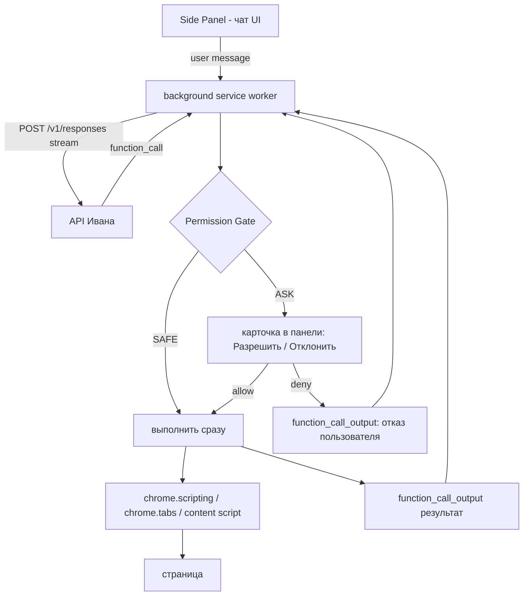

# Chrome-плагин «ChatGPT-агент в браузере»

Вариант A — тонкий клиент. Без бэкенда, без прокси, без гибридов. Только расширение.

## 1. Схема



Ключ API и вся история — в `chrome.storage.local`. Наружу уходит только запрос в API Ивана.

## 2. Система разрешений

Требование: агент **обязан спрашивать** перед действиями. Три уровня.

| Уровень    | Поведение                                                                                       | Tool'ы                                                          |
| ---------- | ----------------------------------------------------------------------------------------------- | --------------------------------------------------------------- |
| SAFE       | выполняется молча, в чате видна плашка «прочитал страницу»                                      | `get_page_context`, `read_selection`, `scroll_to`, `web_search` |
| ASK        | карточка подтверждения с деталями; есть чекбокс «не спрашивать для этого домена в этой комнате» | `fill_form`, `click_element`, `open_url`                        |
| ASK ALWAYS | карточка **всегда**, без возможности отключить, с полным исходником                             | `run_script`                                                    |

Механика:
1. Agent-loop получает `function_call`, определяет уровень.
2. Для ASK/ASK ALWAYS — кладёт вызов в `pendingApprovals`, шлёт в Side Panel.
3. Панель рендерит карточку: название действия, человекочитаемое описание, детали (поля формы + значения / подпись кнопки / URL / код скрипта).
4. Ответ возвращается в SW. `deny` → `function_call_output` c текстом `"Пользователь отклонил действие"`, чтобы модель предложила альтернативу, а не зациклилась.
5. Таймаут ожидания — 120 с, дальше авто-deny.

## 3. Tool'ы

| Tool               | Уровень    | Аргументы                                 | Результат                                                 |
| ------------------ | ---------- | ----------------------------------------- | --------------------------------------------------------- |
| `get_page_context` | SAFE       | `include_html?`                           | URL, title, очищенный текст, карта элементов с `agent_id` |
| `read_selection`   | SAFE       | —                                         | выделенный пользователем текст                            |
| `scroll_to`        | SAFE       | `agent_id`                                | ok                                                        |
| `fill_form`        | ASK        | `fields: [{agent_id, value}]`             | список заполненных полей                                  |
| `click_element`    | ASK        | `agent_id`                                | ok + изменился ли URL                                     |
| `open_url`         | ASK        | `url`, `new_tab`                          | id вкладки                                                |
| `run_script`       | ASK ALWAYS | `code`, `purpose`                         | сериализованный результат                                 |
| `web_search`       | SAFE       | нативный тул Responses — **не реализуем** | —                                                         |

### Карта элементов
Content script при `get_page_context` вешает `data-agent-id="a17"` на каждый `input / textarea / select / button / a[href] / [role=button] / [contenteditable]` и отдаёт компактный список:

```
a17  input[type=email]  label="Email"  placeholder="you@mail.com"  value=""
a18  button             text="Отправить"
```

Модель оперирует только `agent_id` — никаких CSS-селекторов, они ломаются.

### `fill_form` и React/Vue
Простое присвоение `el.value` фреймворки не видят. Ставим значение через нативный сеттер прототипа и диспатчим `input` + `change` с `bubbles: true`.

### `run_script`
MV3 запрещает `eval` в расширении. Выполнение только через `chrome.scripting.executeScript` с `world: "MAIN"` и функцией-обёрткой, принимающей код через `args`. Перед запуском — обязательный показ кода пользователю.

## 4. Комнаты

- `chrome.storage.local`: `rooms: [{id, title, createdAt, updatedAt, model, messages[], allowedActions{}}]`.
- Заголовок комнаты — первые ~40 символов первого сообщения (позже можно попросить модель сгенерировать).
- Переключение комнат в шапке панели, поиск по названию, удаление.
- `allowedActions` хранит выданные «не спрашивать для домена» разрешения, только в пределах комнаты.

## 5. Структура файлов

```
manifest.json           MV3; permissions: activeTab, scripting, storage, sidePanel, tabs
                        host_permissions: <all_urls>
background.js           agent-loop, вызовы Responses API, диспетчер tool'ов, permission gate
content.js              разметка data-agent-id, чтение DOM, fill/click/scroll
sidepanel.html
sidepanel.js            рендер чата, стриминг, карточки подтверждения, список комнат
sidepanel.css           тёмная тема под ChatGPT
options.html
options.js              base URL, API-ключ, модель
lib/sse.js              парсер SSE-потока Responses API
lib/markdown.js         markdown + подсветка кода
lib/tools.js            JSON-схемы tool'ов и уровни риска
```

## 6. Порядок реализации

1. `manifest.json` + пустой Side Panel, который открывается по клику на иконку.
2. `options` — сохранение base URL / ключа / модели.
3. Стриминг чата без tool'ов: отправка в `/v1/responses`, парсинг SSE, рендер markdown.
4. Комнаты: создание, переключение, персист.
5. `content.js` + `get_page_context` — первый tool, SAFE.
6. Permission gate + карточки в панели.
7. `fill_form`, `click_element`, `open_url`, `scroll_to`, `read_selection`.
8. `run_script` с показом кода.
9. `web_search` в `tools[]`.
10. Обкатка на реальных формах.

## 7. Подключение

- **Base URL:** `<BASE_URL из config.js>`, эндпоинт `POST /v1/responses`.
- **API-ключ:** выдан, вводится в options и хранится в `chrome.storage.local`. В репозиторий и в план не пишем.
- **Модель:** семейство GPT-5, точное имя определяем запросом `GET /v1/models` к прокси перед первым коммитом настроек.
- **Reasoning:** `reasoning: { effort: "high" }` — требование «максимальное размышление». Уровень выносим в options (`low / medium / high`), дефолт `high`.

Пример тела запроса:

```json
{
  "model": "<из /v1/models>",
  "stream": true,
  "reasoning": { "effort": "high" },
  "input": [ ... ],
  "tools": [
    { "type": "web_search" },
    { "type": "function", "name": "get_page_context", "parameters": { } }
  ]
}
```

## 8. Безопасность ключа

- Ключ только в `chrome.storage.local`, никогда в исходниках и не в git.
- В `.gitignore` — всё, что может содержать ключ.
- Ключ, присланный в переписке, стоит ротировать после отладки.
